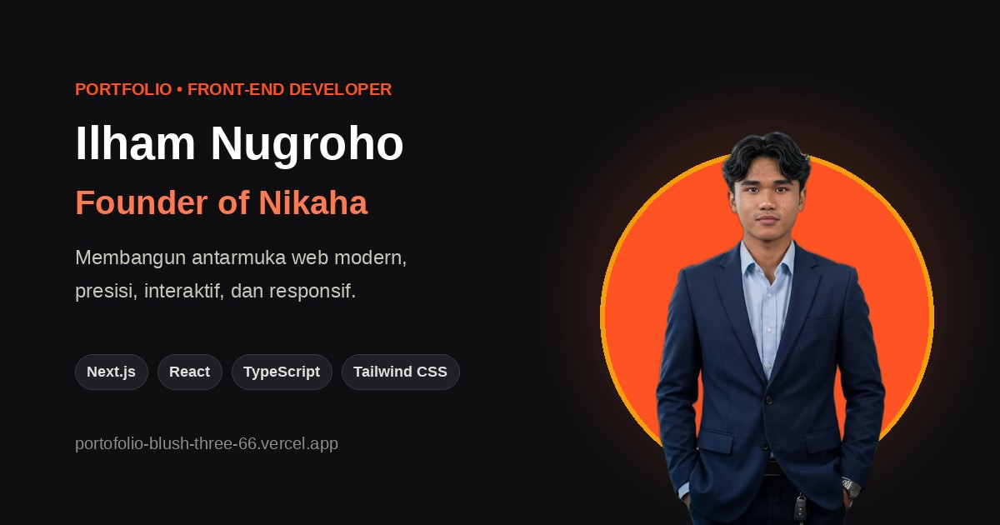

# 🚀 Ilham Nugroho — Personal Portfolio

<p align="center">
  
</p>

<p align="center">
  <a href="https://portofolio-blush-three-66.vercel.app/"></a>
  
  
  
  
</p>

---

## 📌 Tentang Portofolio

Website portofolio modern, responsif, dan interaktif yang dibangun oleh **Ilham Nugroho** — *Front-End Developer*, Mahasiswa Teknik Informatika di Universitas Duta Bangsa Surakarta, dan Founder dari [Nikaha](https://nikaha.my.id).

Portofolio ini dirancang dengan estetika editorial modern (terinspirasi dari Behance & Awwwards), mengedepankan performa tinggi, tipografi presisi, serta *micro-interactions* halus yang menghidupkan antarmuka tanpa memperlambat loading.

🔗 **Live Website:** [https://portofolio-blush-three-66.vercel.app/](https://portofolio-blush-three-66.vercel.app/)

---

## ✨ Fitur & Animasi Utama

- ⚡ **Typewriter Effect (Hero Section)**: Animasi ketik dinamis yang berulang secara halus (*infinite loop*) bergantian menampilkan peran:
  - `Front-End Developer`
  - `Founder of Nikaha`
  - `AI-Assisted Developer`
- 🧲 **Magnetic Button Physics**: Tombol aksi utama (CTA) memiliki gaya tarik elastis ke arah kursor mouse dengan *spring return animation* yang elegan.
- 🎯 **Subtle Mouse Parallax**: Foto cutout dan kubah aksen oranye pada Hero Section bergerak berlawanan arah secara halus mengikuti koordinat mouse.
- 📊 **Scroll Progress Bar**: Indikator tipis 2.5px di bagian paling atas viewport yang melacak progres membaca halaman secara real-time.
- 🔢 **Animated Metric Counter (Skills Section)**: Penghitung angka dinamis (`3+`, `100%`, `10+`, `4+`) dengan akselerasi kurva *cubic ease-out* saat section masuk ke viewport.
- 📋 **Micro-Interaction "Tersalin! ✓"**: Fitur salin 1-klik pada email dan nomor WhatsApp dengan badge feedback hijau otomatis.
- 🖥️ **Interactive Project Showcase**: Frame mockup browser interaktif untuk proyek unggulan **Nikaha** dan modal preview live untuk proyek lainnya (PDFTools, Gym Tracker).
- 🌓 **Theme Switcher**: Dock navigasi bergaya kapsul kaca (*glassmorphism*) dengan tombol toggle tema terang/gelap yang tersimpan di `localStorage`.
- 🔍 **Production-Ready SEO**: Dilengkapi Open Graph tags lengkap, Twitter Cards dengan banner 1200×630px, dan favicon monogram kustom.

---

## 🛠️ Tech Stack & Ekosistem

| Lapisan | Teknologi |
|---|---|
| **Framework** | [Next.js 16 (App Router + Turbopack)](https://nextjs.org/) |
| **Library UI** | [React 19](https://react.dev/) |
| **Bahasa** | [TypeScript 5](https://www.typescriptlang.org/) (Strict Mode) |
| **Styling** | [Tailwind CSS 4](https://tailwindcss.com/) + CSS Variables Tokens |
| **Tipografi** | [Fraunces](https://fonts.google.com/specimen/Fraunces) & [DM Sans](https://fonts.google.com/specimen/DM+Sans) (`next/font/google`) |
| **Aset Gambar** | WebP format terkompresi (<300KB total) + Next.js `<Image>` optimization |
| **Deployment** | [Vercel](https://vercel.com/) |

---

## 📂 Struktur Direktori

```bash
web_porto/
├── app/
│   ├── favicon.ico          # Multi-resolusi favicon (16x16 s/d 256x256)
│   ├── globals.css          # Design tokens, keyframe animations, typography
│   ├── layout.tsx           # Root layout, Google Fonts, Open Graph metadata
│   └── page.tsx             # Halaman utama & observer scroll reveal
├── components/
│   ├── About.tsx            # Section tentang, bio, edukasi, & workspace photo
│   ├── Contact.tsx          # Form kontak, salin clipboard, info sosial
│   ├── DemoModal.tsx        # Modal browser preview untuk live demo
│   ├── FeaturedProject.tsx  # Showcase proyek unggulan (Nikaha) & browser mockup
│   ├── Footer.tsx           # Footer minimalis & tautan eksternal
│   ├── Hero.tsx             # Heading utama, typewriter effect, & foto parallax
│   ├── MagneticButton.tsx   # Reusable component tombol fisika magnetik
│   ├── Navbar.tsx           # Floating glass dock & progress bar scroll
│   ├── OtherProjects.tsx    # Grid portofolio proyek akademik & independen
│   └── Skills.tsx           # Kategori keahlian & animated counter statistik
├── data/
│   ├── projects.ts          # Data terstruktur proyek (Nikaha, PDFTools, Gym Tracker)
│   └── skills.ts            # Data keahlian, teknologi, dan metrik
└── public/
    ├── apple-touch-icon.png # Ikon homescreen smartphone
    ├── icon.png             # Ikon branding resolusi tinggi
    ├── ilham-cutout.webp    # Foto potret hero cutout (WebP 48KB)
    ├── og-image.jpg         # Banner resmi Open Graph (1200x630px)
    └── projects/            # Screenshot proyek terkompresi (WebP)
```

---

## 🚀 Menjalankan Secara Lokal

1. **Clone repository:**
   ```bash
   git clone https://github.com/inugroho399-alt/Portofolio.git
   cd Portofolio
   ```

2. **Install dependensi:**
   ```bash
   npm install
   ```

3. **Jalankan server pengembangan:**
   ```bash
   npm run dev
   ```
   Buka [http://localhost:3000](http://localhost:3000) pada browser Anda.

4. **Build untuk produksi:**
   ```bash
   npm run build
   npm run start
   ```

---

## 📬 Kontak & Kerja Sama

Tertarik untuk berkolaborasi atau memiliki tawaran proyek? Jangan ragu untuk menghubungi:

- **Nama**: Ilham Nugroho
- **Email**: [inugroho399@gmail.com](mailto:inugroho399@gmail.com)
- **WhatsApp**: [083149596357](https://wa.me/6283149596357)
- **GitHub**: [@inugroho399-alt](https://github.com/inugroho399-alt)
- **Instagram**: [@17obie_](https://instagram.com/17obie_)
- **Bisnis / Startup**: [nikaha.my.id](https://nikaha.my.id)
- **Lokasi**: Sukoharjo, Jawa Tengah, Indonesia

---

<p align="center">
  Didesain dan dikembangkan dengan ❤️ oleh <b>Ilham Nugroho</b> © 2026. All rights reserved.
</p>
